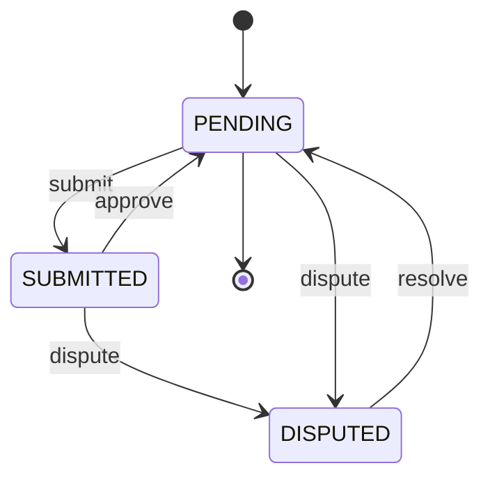
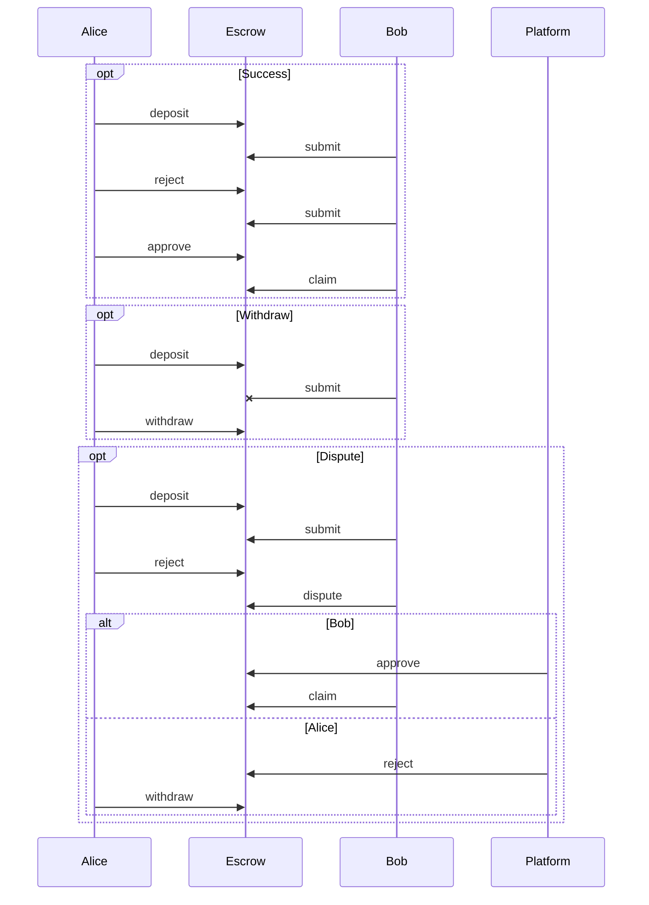

# `@midcontract/protocol`

Crypto payment protocol with escrow





## Install

```shell
npm install --save-prod @midcontract/protocol
```

## Licensing
The primary license for the Midcontract protocol is MIT, see [`LICENSE`](LICENSE)
